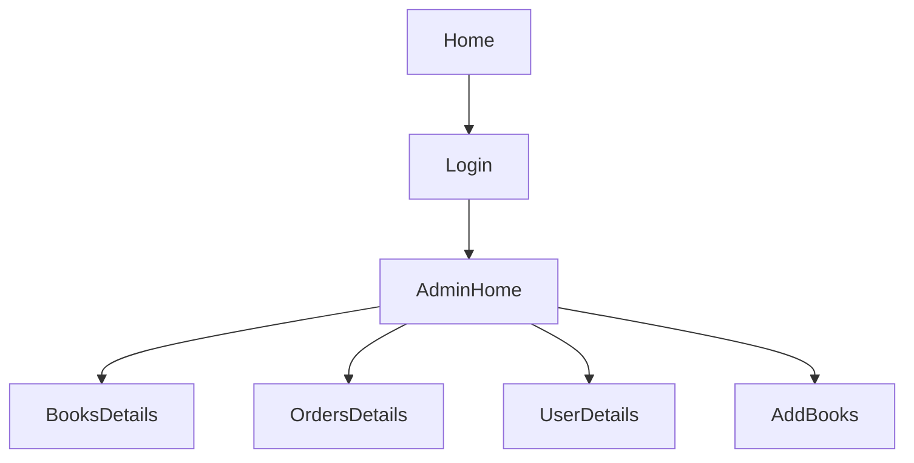
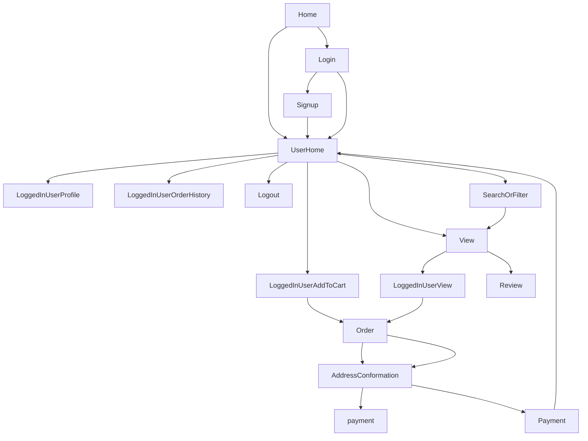

# Book Sales Management System

## Description
The objective of the system is to allow the user to purchase the books online and the administrator to manage the orders and maintain the book stocks.

## Features
#### Admin

1. The admin can find the top sales books.
2. The admin can find the top buyers of the shop.
3. The admin can see the list of information of which have low quantity of books.
4. The admin can see the information of orders and customers who order the books.
5. The admin can see all list of users who login to the system.
6. Admin can add books.
7. Admin can update the quantity, price of books.

#### User

1. The users can search the books by using author name, book name, publisher name.
2. The user can add their favorite books to cart and save it.
3. The user can see their profile and order history.
4. The user sees the books by category wise.
5. The user can filter the books based on language.
6. The user can filter the books by price.
7. The user can see the top searched books.
8. The user can rate the books.
9. The user can review the books.
10. The user can see the related books of the book which they view.
11. The user can remove the product which is added to the cart.
12. The user can change their address and phone number.
13. The user can buy multiple product at the same time.
14. If the user forgot the password they can change it using username.
15. The user can see their order history.

## Project Flow

##### Admin Side Flow

##### User Side Flow

